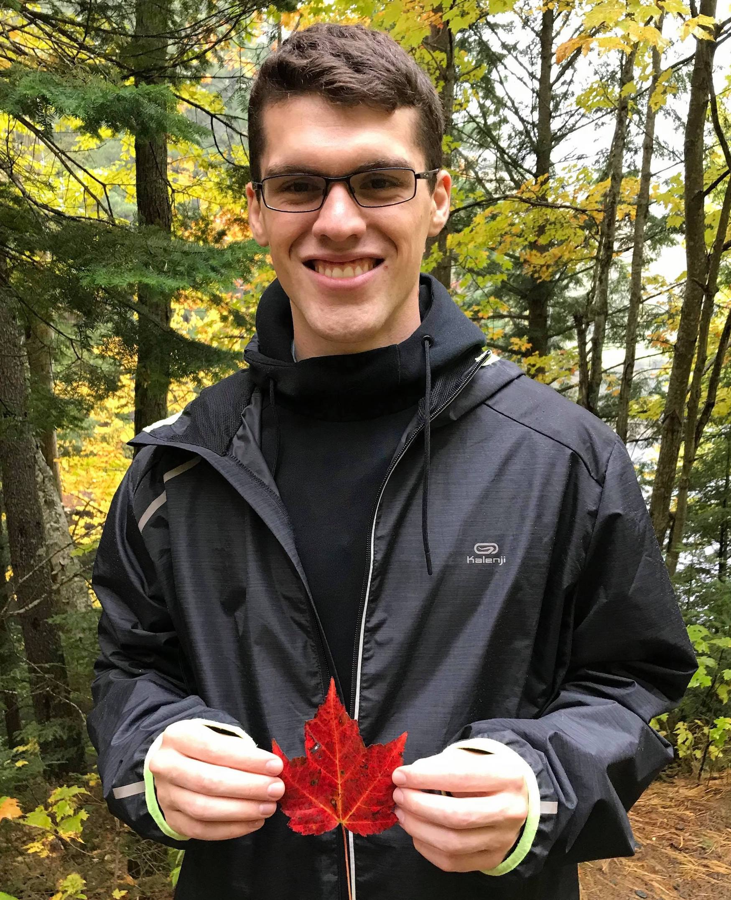

# Peter W. MacDonald

<!--  -->

## About

I am a PhD candidate in the Department of Statistics at the University of Michigan. I work primarily on statistical analysis of multiple networks. I am co-advised by [Dr. Elizaveta Levina](https://lsa.umich.edu/stats/people/faculty/elevina.html) and [Dr. Ji Zhu](https://lsa.umich.edu/stats/people/faculty/jizhu.html), and a member of their [research group](http://dept.stat.lsa.umich.edu/~elevina/group.html). Previously, I received my MMath (Statistics) and my BMath (Statistics and Pure Mathematics) from the University of Waterloo (ON).

## Research Interests

### Multilayer and dynamic networks
**(with Elizaveta Levina and Ji Zhu, UMich)**

- Latent space models for common and individual structure in multiplex networks (forthcoming in Biometrika, pre-print on arXiv, `multiness` R package on GitHub).
- Latent space models for dynamic networks.

### Post-selection inference
**(with Dan Kessler and Snigdha Panigrahi, UMich)**

- Valid post-selection inference with grouped sparsity (submitted to the Journal of Machine Learning Research, pre-print on arXiv).

### Multiple testing and false discovery rate (FDR) control
**(with Kun Liang and Yingli Qin, UWaterloo)**

- Dynamic-adaptive procedures which control the FDR (paper in the Electronic Journal of Statistics).
- Multiple hypothesis testing with group information (book chapter in Modern Statistical Methods for Health Research).

## Links

- Publications on [Google Scholar](https://scholar.google.ca/citations?user=yB4ft9EAAAAJ&hl=en&authuser=1).
- Pre-prints on [arXiv](https://arxiv.org/search/stat?searchtype=author&query=MacDonald%2C+P+W).
- Code on [GitHub](https://github.com/peterwmacd).
<!-- - multiness on CRAN  -->
- Follow me on [Strava](https://www.strava.com/athletes/10522364), join [PR Run Club](https://www.prrunclub.com/) Ann Arbor.

## Education

- MMath, University of Waterloo, 2018.
- BMath, University of Waterloo, 2017.

## Selected awards and honors

- Statistical Learning and Data Science (SLDS) Student Paper Award, JSM 2021.
- Rackham International Student Fellowship, University of Michigan, 2019.
- Outstanding First Year PhD Student, University of Michigan Department of Statistics, 2019.
- NSERC Canada Graduate Scholarship (Masters), University of Waterloo, 2017.
- President's Graduate Scholarship, University of Waterloo, 2017.

## Contact information

Email: pwmacdon@umich.edu
